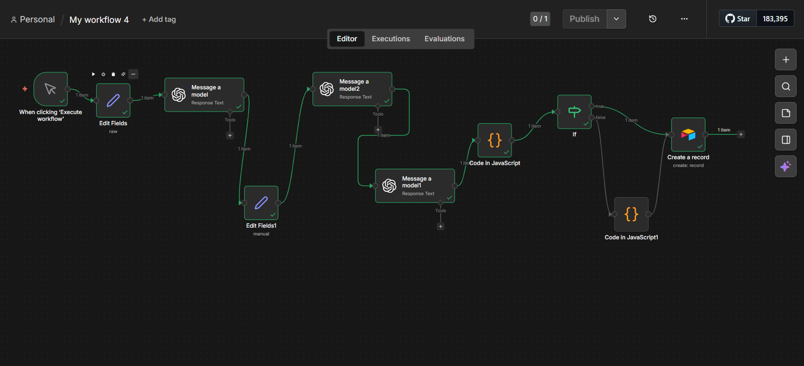
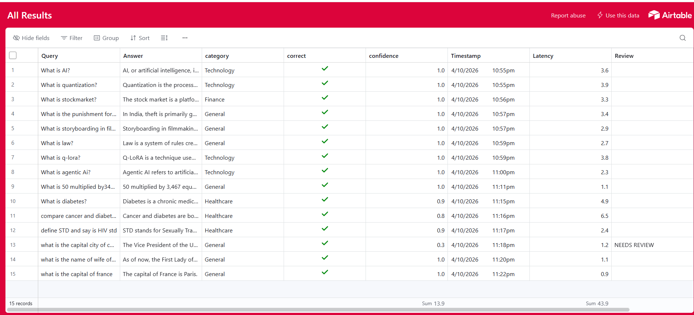

# AI Evaluation & Monitoring System
## Screenshots

### n8n Workflow

### Airtable Dashboard

## Overview
This project is an AI evaluation pipeline designed to monitor and analyze the quality of responses generated by Large Language Models (LLMs).

It simulates a real-world system where AI outputs are not blindly trusted, but evaluated, logged, and reviewed.
## Problem
Large Language Models (LLMs) can generate incorrect, misleading, or irrelevant answers.

In real-world applications, blindly trusting AI responses can lead to poor user experience and critical errors.

There is a need for a system that can:
- Evaluate AI-generated responses
- Measure their quality
- Identify incorrect outputs
- Enable monitoring and improvement
## Solution
To address this problem, I built an AI evaluation and monitoring system.

The system works as follows:
- A user provides a query
- An AI model generates a response
- Another AI model evaluates the response based on correctness, relevance, and clarity
- The system assigns a confidence score and a verdict (good or bad)
- All results are stored in Airtable for tracking and analysis
- Incorrect responses are flagged as "NEEDS REVIEW" for further inspection
## Architecture
The system follows a structured pipeline:

User Query  
→ Answer Model (LLM generates response)  
→ Classifier (categorizes the query)  
→ Evaluator Model (evaluates answer quality)  
→ Code Node (parses evaluation output)  
→ IF Node (decision logic)  
→ Airtable (logging and monitoring)
### Decision Logic
- If verdict = "good" → stored as valid response  
- If verdict = "bad" → flagged as "NEEDS REVIEW"
## Features
- AI-generated responses using LLMs
- Automated evaluation of responses (score + verdict)
- Query classification into categories (Technology, Healthcare, etc.)
- Confidence scoring for each response
- Latency tracking for performance monitoring
- Detection and flagging of incorrect responses
- "NEEDS REVIEW" tagging for bad outputs
- Airtable-based logging and monitoring system
- ## Tech Stack
- n8n (workflow automation)
- OpenAI API (LLM models)
- Airtable (data storage and monitoring)
## How to Use
1. Import the workflow JSON file into n8n
2. Connect your OpenAI API credentials
3. Connect your Airtable account and base
4. Configure required fields in Airtable (query, answer, category, confidence, etc.)
5. Execute the workflow
6. View results and monitoring data in Airtable
## Future Improvements
- Add retry mechanism with limit for failed responses
- Improve evaluation prompts for more accurate scoring
- Build advanced dashboard (Looker Studio / React)
- Add cost tracking per API request
- Implement feedback loop for continuous improvement

## Author
- Sushith.M

